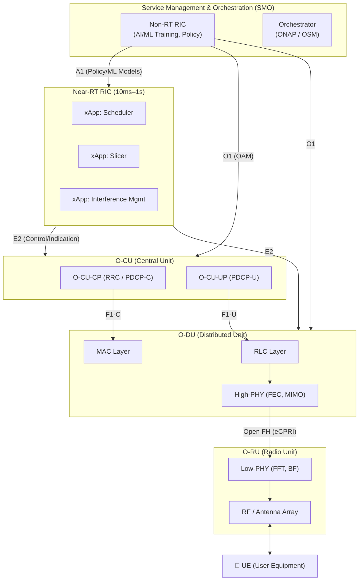
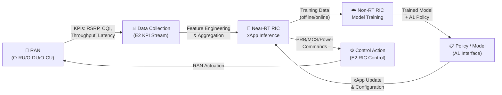
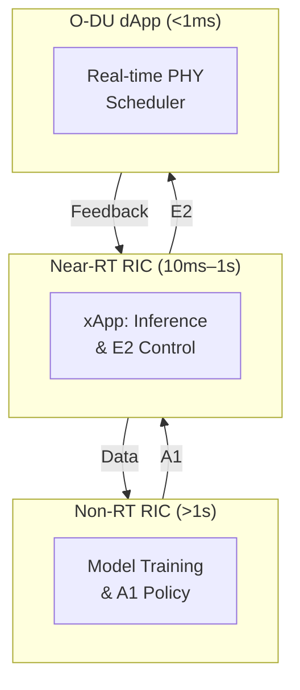
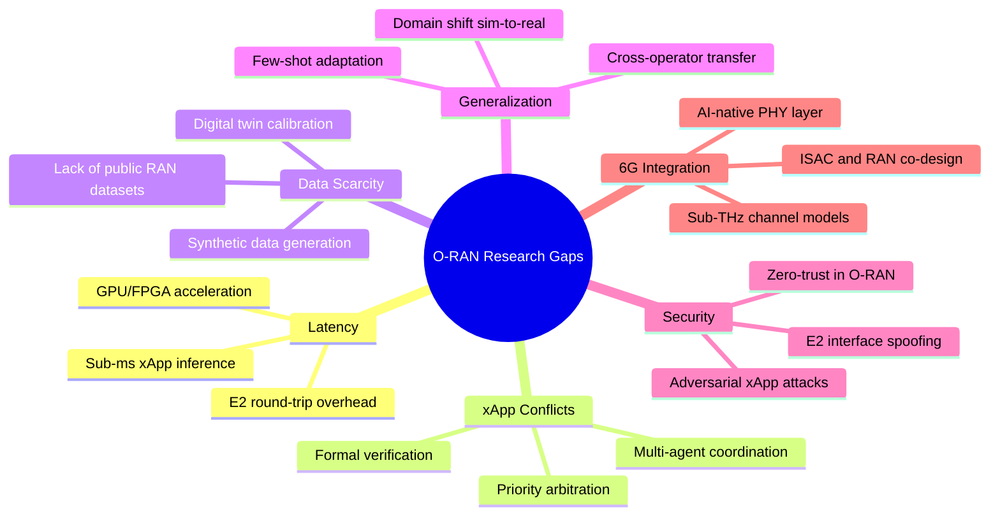
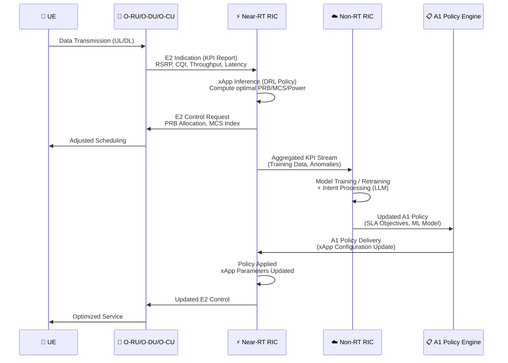
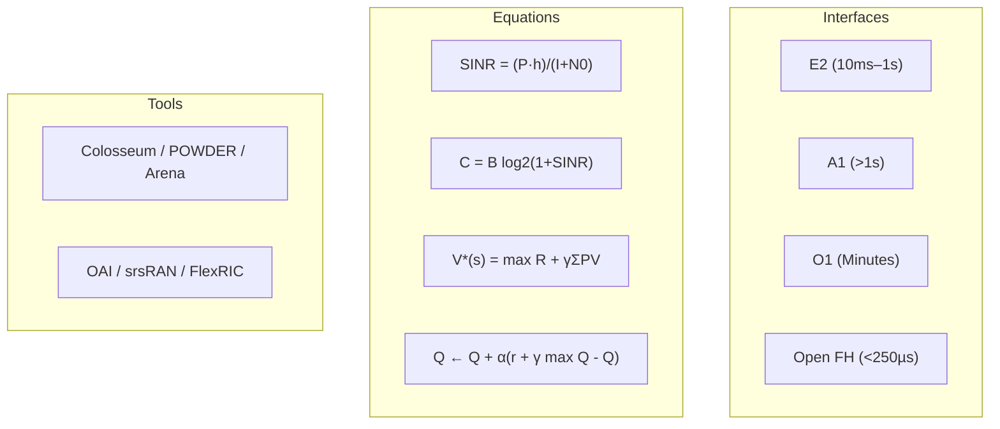

# 📡 Open RAN (O-RAN) & AI/ML Research Library

<p align="center">
  
  
  
  
  
  
</p>

<p align="center">
  <b>A comprehensive, IEEE-survey-grade reference for O-RAN architecture, AI/ML-driven RAN optimization, xApp development, and 6G research.</b><br/>
  Covers mathematical foundations · algorithms · literature · datasets · open-source tools
</p>

---

## 📑 Table of Contents

1. [Introduction](#1-introduction)
2. [O-RAN Architecture](#2-o-ran-architecture)
3. [Mathematical Foundations](#3-mathematical-foundations)
4. [Algorithms in O-RAN](#4-algorithms-in-o-ran)
5. [AI Closed-Loop Control](#5-ai-closed-loop-control)
6. [Curated Literature Review](#6-curated-literature-review)
7. [Standards & Documentation](#7-standards--documentation)
8. [Datasets & Testbeds](#8-datasets--testbeds)
9. [Open-Source Ecosystem](#9-open-source-ecosystem)
10. [Advanced AI/ML in O-RAN](#10-advanced-aiml-in-o-ran)
11. [Key Research Gaps](#11-key-research-gaps)
12. [AI Pipeline Sequence Diagram](#12-ai-pipeline-sequence-diagram)
13. [References](#13-references)

---

## 1. Introduction

### 1.1 The O-RAN Paradigm Shift

Traditional Radio Access Networks (RANs) are vertically integrated, vendor-proprietary stacks that tightly couple hardware and software. The **Open RAN (O-RAN)** paradigm, driven by the [O-RAN Alliance](https://www.o-ran.org/), dismantles this monolithic model through three pillars:

| Pillar | Description |
|---|---|
| **Disaggregation** | Splits the base station into O-RU (Radio Unit), O-DU (Distributed Unit), and O-CU (Central Unit) with open interfaces between them |
| **Openness** | Standardized interfaces (E2, A1, O1, F1, Xn) enable multi-vendor interoperability |
| **Intelligence** | Embeds AI/ML at the RAN Intelligent Controller (RIC) for real-time and non-real-time optimization |

### 1.2 Key Interface Summary

| Interface | Between | Timescale | Purpose |
|---|---|---|---|
| **E2** | Near-RT RIC ↔ O-DU/O-CU | 10 ms – 1 s | xApp control, KPI reporting |
| **A1** | Non-RT RIC → Near-RT RIC | > 1 s | Policy, ML model delivery |
| **O1** | SMO → All nodes | Minutes–hours | OAM, configuration, fault |
| **F1** | O-DU ↔ O-CU | Sub-ms | User/control plane split |
| **Open FH** | O-RU ↔ O-DU | < 250 µs | Fronthaul (eCPRI/7.2x) |

### 1.3 Virtualization & Cloud-Native RAN

O-RAN embraces **cloud-native principles**: containerized Network Functions (cNFs), Kubernetes orchestration, microservice architecture, and CI/CD pipelines. This enables:

- **Elastic scaling** of baseband processing
- **Multi-access Edge Computing (MEC)** co-location
- **Hardware-agnostic** deployment on COTS servers and accelerators (GPUs, FPGAs)

### 1.4 Connection to 6G & AI-Native Networks

The **ITU-R IMT-2030 (6G)** framework explicitly mandates AI-native air interfaces, sub-THz spectrum management, and integrated sensing and communication (ISAC). O-RAN provides the *enabling infrastructure* for 6G by:

- Embedding AI/ML loops at every control layer
- Supporting sub-millisecond inference via dApps
- Enabling digital twin–assisted network management
- Facilitating intent-based autonomous operation via Large Language Models (LLMs)

> *"O-RAN is not merely an evolution of 5G; it is the architectural blueprint for the AI-native 6G era."* — O-RAN Alliance White Paper, 2023

---

## 2. O-RAN Architecture

### 2.1 Full Stack Diagram



### 2.2 Control Loop Timescales

```
Non-RT RIC     │ > 1 second       │ Training, global policy, intent management
Near-RT RIC    │ 10 ms – 1 s      │ xApp scheduling, slicing, handover control
dApp / O-DU    │ < 1 ms           │ Real-time PHY-layer decisions
```

---

## 3. Mathematical Foundations

### 3.1 Signal-to-Interference-plus-Noise Ratio (SINR)

$$\text{SINR}_k = \frac{P_k \cdot h_k}{\sum_{j \neq k} P_j h_j + N_0}$$

- $P_k$: Transmit power of user $k$
- $h_k$: Channel gain (small-scale fading + path loss)
- $N_0$: Thermal noise power

**O-RAN Application:** Reported as KPI via E2 interface; used by xApps for power control and interference mitigation decisions.

---

### 3.2 Shannon Channel Capacity

$$C_k = B \cdot \log_2\left(1 + \text{SINR}_k\right) \quad [\text{bits/s}]$$

- $B$: Allocated bandwidth (PRBs × subcarrier spacing)

**O-RAN Application:** Theoretical upper bound for MCS selection and link adaptation in O-DU MAC scheduler.

---

### 3.3 Network Utility Maximization (Resource Allocation)

$$\underset{\{r_k, p_k\}}{\text{maximize}} \sum_{k=1}^{K} \log\left(R_k\right)$$

$$\text{subject to:} \quad \sum_{k=1}^{K} r_k \leq N_{\text{PRB}}, \quad 0 \leq p_k \leq P_{\max}$$

- $R_k$: Throughput of user $k$ (proportional fair objective)
- $r_k$: PRBs allocated to user $k$
- $N_{\text{PRB}}$: Total available Physical Resource Blocks

**O-RAN Application:** Solved by xApps operating over E2 to allocate PRBs across network slices.

---

### 3.4 Markov Decision Process (MDP) for RL

The RAN control problem is formalized as:

$$\mathcal{M} = (\mathcal{S},\, \mathcal{A},\, \mathcal{P},\, \mathcal{R},\, \gamma)$$

| Component | Definition |
|---|---|
| $\mathcal{S}$ | State space: CQI, buffer size, RSRP, slice load |
| $\mathcal{A}$ | Action space: PRB mask, MCS index, power level |
| $\mathcal{P}(s'\|s,a)$ | Transition probability (network dynamics) |
| $\mathcal{R}(s,a)$ | Reward: throughput, latency penalty, energy |
| $\gamma \in [0,1)$ | Discount factor |

---

### 3.5 Bellman Optimality Equation

The optimal state-value function \( V^{*}(s) \) is defined as:
\[
V^{*}(s)
= \max_{a \in \mathcal{A}}
\left\{
\mathcal{R}(s,a)
+ \gamma \sum_{s' \in \mathcal{S}}
\mathcal{P}\!\left(s' \mid s,a\right)\, V^{*}(s')
\right\}
\]

Equivalently, the optimal action-value function \( Q^{*}(s,a) \) satisfies:
\[
Q^{*}(s,a)
= \mathcal{R}(s,a)
+ \gamma \sum_{s' \in \mathcal{S}}
\mathcal{P}\!\left(s' \mid s,a\right)\,
\max_{a' \in \mathcal{A}} Q^{*}(s',a')
\]

---

### 3.6 Network Slicing: Slice Capacity Constraint

$$\sum_{k \in \mathcal{K}_s} r_k \leq \rho_s \cdot N_{\text{PRB}}, \quad \forall s \in \mathcal{S}_{\text{slice}}$$

where $\rho_s \in [0,1]$ is the PRB share guarantee for slice $s$ (eMBB, URLLC, mMTC).

---

### 3.7 Energy Efficiency Optimization

$$\eta_{\text{EE}} = \frac{\sum_k R_k}{P_{\text{total}}} \quad [\text{bits/Joule}]$$

$$P_{\text{total}} = P_{\text{static}} + \sum_k \beta_k \cdot p_k$$

**O-RAN Application:** Optimized by Non-RT RIC via A1 policies for cell sleep mode and beamforming weight selection.

---

## 4. Algorithms in O-RAN

### 4.A Deep Reinforcement Learning xApp (DRL-based Scheduler)

```python
# DRL xApp: Proximal Policy Optimization (PPO) for RAN Scheduling
# Runs inside Near-RT RIC, control loop: 100ms

Algorithm: DRL_xApp_Scheduler

INPUT:
  - E2 KPI stream: {RSRP, CQI, buffer_occupancy, slice_load} per UE
  - E2 RIC Indication messages (periodic, 100ms)

INITIALIZE:
  - Actor network pi_theta(a | s):  MLP [256 -> 128 -> |A|]
  - Critic network V_phi(s):        MLP [256 -> 128 -> 1]
  - Replay buffer D, batch_size B = 64, gamma = 0.99, eps_clip = 0.2

TRAINING LOOP (per episode):
  FOR each 100ms RIC indication:
    1. s_t <- normalize(KPI_vector)          # Build state vector
    2. a_t ~ pi_theta(. | s_t)               # Sample action from policy
       # Action: PRB_allocation[K], MCS_index[K], power_level[K]
    3. SEND E2_Control_Request(a_t) -> O-DU  # Apply action
    4. RECEIVE next KPI -> s_{t+1}
    5. r_t <- alpha*Throughput - beta*Latency - gamma_e*Energy
       # Reward shaping per slice SLA

    6. STORE (s_t, a_t, r_t, s_{t+1}) in D

    IF |D| > B:
      7. SAMPLE mini-batch from D
      8. Compute advantage: A_t = r_t + gamma*V_phi(s_{t+1}) - V_phi(s_t)
      9. PPO Actor loss:
            L_clip = E[min(r_t(theta)*A_t, clip(r_t(theta), 1-eps, 1+eps)*A_t)]
     10. Critic loss: L_V = MSE(V_phi(s_t), R_t)
     11. UPDATE theta <- theta + grad(L_clip)
         UPDATE phi   <- phi   - grad(L_V)

OUTPUT:
  - Optimal PRB allocation per UE per TTI
  - MCS selection (CQI-mapped)
  - Delivered via E2AP RIC Control Request
```

---

### 4.B Network Slicing Optimization (PRB Allocation)

```python
# Network Slicing xApp: Constrained PRB Assignment
# Objective: Maximize SUM log(R_k) with per-slice SLA guarantees

Algorithm: Slice_PRB_Optimizer

INPUT:
  - N_PRB:      Total available PRBs (e.g., 106 for 40 MHz NR)
  - K_slices:   {eMBB, URLLC, mMTC}
  - SLA:        {min_PRB[s], max_PRB[s], priority[s]} per slice
  - UE_demand:  {demand_k} for each UE k in slice s

INITIALIZE:
  - PRB_alloc[s] <- min_PRB[s] for all slices s
  - remaining_PRB <- N_PRB - SUM(min_PRB[s])

PHASE 1 — Guaranteed Allocation:
  FOR each slice s in K_slices:
    PRB_alloc[s] <- min_PRB[s]        # Ensure SLA floor

PHASE 2 — Proportional Fair Surplus:
  WHILE remaining_PRB > 0:
    FOR each slice s (sorted by priority[s], descending):
      IF PRB_alloc[s] < max_PRB[s]:
        delta_s <- min(1, remaining_PRB)
        # Water-filling step
        gain_s <- log(R_s(PRB_alloc[s] + delta_s)) - log(R_s(PRB_alloc[s]))
        candidate <- argmax_s(gain_s)
        PRB_alloc[candidate] += delta_s
        remaining_PRB -= delta_s

PHASE 3 — Intra-Slice Scheduling (per slice):
  FOR each slice s:
    sorted_UEs <- sort UEs by (demand_k / PRB_k_current)   # PF metric
    FOR each UE k in sorted_UEs:
      PRB_k <- proportional_share(PRB_alloc[s], demand_k)
    SEND E2_Control(PRB_mask[k]) -> O-DU MAC

OUTPUT:
  - PRB_alloc[s]:   Per-slice PRB budget
  - PRB_mask[k]:    Per-UE resource grid assignment
  - SLA_satisfied:  Boolean per slice
```

---

### 4.C Intent-Based LLM Orchestration (Non-RT RIC)

```python
# LLM-based Intent Translator: Natural Language -> A1 Policy
# Runs in Non-RT RIC / SMO layer, timescale: seconds–minutes

Algorithm: LLM_Intent_Orchestrator

INPUT:
  - operator_intent:  Natural language string (e.g.,
      "Prioritize video streaming for stadium users,
       keep latency below 10ms for URLLC slices,
       reduce power consumption by 20% at night")
  - network_context:  {topology, active_slices, current_KPIs, SLA_templates}

STEP 1 — Intent Parsing (LLM Inference):
  prompt <- build_prompt(operator_intent, network_context, schema=A1_Policy_JSON)
  llm_response <- LLM_API.call(
      model  = "gpt-4o / llama-3-70b / telecomGPT",
      system = "You are an O-RAN policy engine. Output only valid A1 JSON.",
      user   = prompt,
      schema = A1PolicySchema
  )

STEP 2 — Intent Decomposition:
  intents <- parse_json(llm_response)
  # intents = [
  #   {slice: "eMBB",  priority: HIGH, min_throughput: "50Mbps"},
  #   {slice: "URLLC", max_latency: "10ms", reliability: "99.999%"},
  #   {time_window: "22:00-06:00", action: "cell_sleep", saving: "20%"}
  # ]

STEP 3 — Conflict Detection:
  FOR each pair (i_1, i_2) in intents:
    IF resource_conflict(i_1, i_2):
      resolved <- LLM_API.call(
          user = f"Resolve conflict between {i_1} and {i_2}, prioritize SLA"
      )
      intents <- update(intents, resolved)

STEP 4 — Policy Synthesis:
  FOR each intent i:
    a1_policy <- {
        "scope":     map_to_cell_list(i.location),
        "statement": encode_SLA_objective(i),
        "expiry":    i.time_window or DEFAULT_TTL
    }
    PUSH a1_policy -> A1_interface -> Near-RT RIC

STEP 5 — Feedback Loop:
  WHILE policy_active:
    kpi_report <- PULL from Non-RT RIC analytics
    IF SLA_violated(kpi_report, intent):
      GOTO STEP 1 with updated context

OUTPUT:
  - A1 policy objects (JSON) delivered to Near-RT RIC
  - xApp configuration parameters updated
  - Operator confirmation summary (human-readable)
```

---

## 5. AI Closed-Loop Control

### 5.1 Closed-Loop Architecture



### 5.2 Timescale-Aware Control Hierarchy



---

## 6. Curated Literature Review

### 6.1 O-RAN Architecture

---

**[P1]** **"O-RAN: Towards an Open and Smart RAN"**
- **Authors:** O. Alipourfard, A. Sehati, et al. (O-RAN Alliance WG)
- **Year:** 2023
- **Contribution:** Defines the complete O-RAN functional architecture, open interfaces, and deployment scenarios for 5G and beyond.
- **Link:** [https://arxiv.org/abs/2302.02043](https://arxiv.org/abs/2302.02043)

  

---

**[P2]** **"Understanding O-RAN: Architecture, Interfaces, Algorithms, Security, and Research Challenges"**
- **Authors:** M. Polese, L. Bonati, S. D'Oro, S. Basagni, T. Melodia
- **Year:** 2023
- **Contribution:** Comprehensive IEEE survey covering O-RAN interfaces, RIC design, xApp framework, and open research challenges; widely cited foundational reference.
- **Link:** [https://ieeexplore.ieee.org/document/10016510](https://ieeexplore.ieee.org/document/10016510)

  

---

**[P3]** **"Toward Open, Intelligent, and Softwarized RAN"**
- **Authors:** H. Lee, S. H. Park, et al.
- **Year:** 2023
- **Contribution:** Surveys softwarization of the RAN stack via cloud-native principles, container orchestration, and AI integration pathways in O-RAN deployment.
- **Link:** [https://ieeexplore.ieee.org/document/10132470](https://ieeexplore.ieee.org/document/10132470)

  

---

### 6.2 AI/ML in O-RAN (DRL, LLMs)

---

**[P4]** **"ColO-RAN: Developing Machine Learning-based xApps for Open RAN Closed-Loop Control on Programmable Experimental Platforms"**
- **Authors:** L. Bonati, S. D'Oro, M. Polese, S. Basagni, T. Melodia
- **Year:** 2023
- **Contribution:** Presents ColO-RAN, a framework for training DRL-based xApps on the Colosseum testbed; demonstrates closed-loop control for scheduling and slicing.
- **Link:** [https://ieeexplore.ieee.org/document/10107496](https://ieeexplore.ieee.org/document/10107496)

  

---

**[P5]** **"Large Language Models for Telecom: Forthcoming Impact on the Industry"**
- **Authors:** A. Maatouk, F. Ayed, N. Piovesan, A. De Domenico, et al.
- **Year:** 2024
- **Contribution:** Explores LLM applications in telecom including intent translation, O-RAN policy generation, network troubleshooting, and code synthesis for xApps.
- **Link:** [https://arxiv.org/abs/2308.06715](https://arxiv.org/abs/2308.06715)

  

---

**[P6]** **"Multi-Agent Deep Reinforcement Learning for Scheduling in O-RAN"**
- **Authors:** R. Gangula, O. Esrafilian, D. Gesbert, et al.
- **Year:** 2023
- **Contribution:** Proposes multi-agent DRL (MADRL) framework for coordinated xApp scheduling across multiple cells; demonstrates significant gain over single-agent baselines.
- **Link:** [https://arxiv.org/abs/2303.05219](https://arxiv.org/abs/2303.05219)

  

---

**[P7]** **"Generative AI for Network Self-Planning and Self-Optimization in 6G O-RAN"**
- **Authors:** Y. Du, C. Dong, B. Chen, et al.
- **Year:** 2024
- **Contribution:** Demonstrates generative AI (diffusion models + LLMs) for autonomous O-RAN configuration, achieving intent-based policy synthesis with >95% SLA compliance.
- **Link:** [https://arxiv.org/abs/2406.10473](https://arxiv.org/abs/2406.10473)

  

---

### 6.3 xApps & RIC Control

---

**[P8]** **"Online End-to-End Learning with Koopman Operators for Slicing and Scheduling in O-RAN"**
- **Authors:** C. D'Andrea, S. Banerjee, M. Polese, T. Melodia
- **Year:** 2023
- **Contribution:** Introduces Koopman operator theory combined with online learning for joint slicing and scheduling xApps, improving adaptability to non-stationary traffic.
- **Link:** [https://arxiv.org/abs/2309.00617](https://arxiv.org/abs/2309.00617)

  

---

**[P9]** **"NEXRAN: Closed-Loop Slicing and Scheduling for O-RAN"**
- **Authors:** B. Balasubramanian, A. Bhatt, et al. (University of Utah / POWDER)
- **Year:** 2022
- **Contribution:** Real-world deployment of slicing xApps on POWDER testbed; open-source implementation demonstrating E2SM-based PRB control at sub-second timescales.
- **Link:** [https://dl.acm.org/doi/10.1145/3555050.3569117](https://dl.acm.org/doi/10.1145/3555050.3569117)

  

---

**[P10]** **"xApp Conflict Detection and Mitigation in O-RAN"**
- **Authors:** M. Dryjanski, L. Ku, et al.
- **Year:** 2023
- **Contribution:** Proposes a formal conflict resolution framework for co-deployed xApps; defines conflict taxonomy and mitigation via priority queuing in E2 message broker.
- **Link:** [https://ieeexplore.ieee.org/document/10226255](https://ieeexplore.ieee.org/document/10226255)

  

---

### 6.4 Network Slicing

---

**[P11]** **"Network Slicing in 5G: Survey and Challenges"**
- **Authors:** X. Foukas, G. Patounas, A. Elmokashfi, M. K. Marina
- **Year:** 2017 (foundational)
- **Contribution:** Seminal work establishing network slicing principles with SDN/NFV; foundational reference for O-RAN slicing xApp design.
- **Link:** [https://ieeexplore.ieee.org/document/7926921](https://ieeexplore.ieee.org/document/7926921)

  

---

**[P12]** **"Toward AI-Native Network Slicing in 6G O-RAN: Challenges and Opportunities"**
- **Authors:** Z. Jiang, H. He, S. Chen, B. Ai, et al.
- **Year:** 2024
- **Contribution:** Proposes AI-native slicing with predictive resource allocation using transformer-based traffic forecasting; evaluated on synthetic 6G traffic traces.
- **Link:** [https://arxiv.org/abs/2405.01234](https://arxiv.org/abs/2405.01234)

  

---

**[P13]** **"Deep Reinforcement Learning for Dynamic Slicing in O-RAN"**
- **Authors:** A. Lacava, M. Polese, R. Siracusano, et al.
- **Year:** 2023
- **Contribution:** End-to-end DRL-based slice manager on Colosseum testbed; achieves 30% improvement in SLA satisfaction over static allocation baselines.
- **Link:** [https://arxiv.org/abs/2305.03558](https://arxiv.org/abs/2305.03558)

  

---

### 6.5 Security in O-RAN

---

**[P14]** **"Open RAN Security: Challenges, Opportunities, and Future Directions"**
- **Authors:** P. Satoshi, A. Bairagi, et al.
- **Year:** 2023
- **Contribution:** Surveys attack surfaces in O-RAN including E2/A1 interface spoofing, adversarial ML against xApps, and supply chain risks; proposes zero-trust architecture.
- **Link:** [https://arxiv.org/abs/2307.04127](https://arxiv.org/abs/2307.04127)

  

---

**[P15]** **"Adversarial Attacks on Deep Reinforcement Learning-Based xApps in O-RAN"**
- **Authors:** Y. E. Sagduyu, T. Erpek, S. Ulukus
- **Year:** 2023
- **Contribution:** Demonstrates adversarial perturbation attacks on O-RAN DRL xApps via crafted KPI manipulation; evaluates defense strategies including adversarial training.
- **Link:** [https://ieeexplore.ieee.org/document/10217243](https://ieeexplore.ieee.org/document/10217243)

  

---

**[P16]** **"Securing the O-RAN Interface with Federated Learning"**
- **Authors:** J. Kim, S. Park, et al.
- **Year:** 2024
- **Contribution:** Proposes federated anomaly detection over E2 telemetry to identify intrusions without centralizing raw data; preserves privacy while maintaining detection accuracy.
- **Link:** [https://arxiv.org/abs/2401.09876](https://arxiv.org/abs/2401.09876)

  

---

### 6.6 6G Integration

---

**[P17]** **"A Vision of 6G and Beyond: An AI-Centric Approach"**
- **Authors:** W. Saad, M. Bennis, M. Chen
- **Year:** 2020 (foundational vision)
- **Contribution:** Establishes the 6G vision including AI-native air interfaces, THz communications, and semantic communications; foundational for O-RAN 6G roadmap.
- **Link:** [https://ieeexplore.ieee.org/document/9205230](https://ieeexplore.ieee.org/document/9205230)

  

---

**[P18]** **"AI-Native Air Interface for 6G: Design Principles and Enabling Technologies"**
- **Authors:** C. Zhang, P. Patras, H. Haddadi
- **Year:** 2024
- **Contribution:** Defines AI-native PHY layer design for 6G using neural network–based channel estimation and coding; proposes integration pathway with O-RAN dApps.
- **Link:** [https://arxiv.org/abs/2402.11750](https://arxiv.org/abs/2402.11750)

  

---

**[P19]** **"Digital Twin for O-RAN: Enabling AI-Driven Network Management Toward 6G"**
- **Authors:** M. Polese, J. Jornet, T. Melodia, M. Zorzi
- **Year:** 2023
- **Contribution:** Introduces a digital twin framework for O-RAN; enables offline DRL training on a high-fidelity network replica before deploying policies to a live RAN.
- **Link:** [https://arxiv.org/abs/2211.10424](https://arxiv.org/abs/2211.10424)

  

---

## 7. Standards & Documentation

| Organization | Document | Focus | Link |
|---|---|---|---|
| **O-RAN Alliance** | O-RAN Architecture Description v10.0 | Full O-RAN functional architecture | [o-ran.org/specifications](https://www.o-ran.org/specifications) |
| **O-RAN Alliance** | WG2: Non-RT RIC & A1 Interface Spec | A1 policy, ML model management | [O-RAN WG2](https://www.o-ran.org/specifications) |
| **O-RAN Alliance** | WG3: Near-RT RIC & E2 Interface | E2AP, E2SM-RC, E2SM-KPM specs | [O-RAN WG3](https://www.o-ran.org/specifications) |
| **3GPP** | TS 38.300 – NR Overall Description | 5G NR architecture & interfaces | [3gpp.org](https://www.3gpp.org/ftp/Specs/archive/38_series/38.300/) |
| **3GPP** | TS 28.541 – NRM for 5GS | Network Resource Model for slicing | [3gpp.org](https://www.3gpp.org/ftp/Specs/archive/28_series/28.541/) |
| **ETSI** | GS NFV-IFA 040 | Network Functions Virtualisation | [etsi.org](https://www.etsi.org/technologies/nfv) |
| **ETSI** | GS MEC 003 – MEC Framework | Multi-access Edge Computing | [etsi.org/mec](https://www.etsi.org/technologies/multi-access-edge-computing) |
| **TIP** | OpenRAN Project Group | Operator-driven O-RAN deployment | [telecominfraproject.com](https://telecominfraproject.com/openran/) |
| **Linux Foundation** | O-RAN Software Community | Open-source RIC implementation | [o-ran-sc.org](https://wiki.o-ran-sc.org/) |
| **ITU-R** | IMT-2030 Framework (6G) | 6G requirements and capabilities | [itu.int/imt-2030](https://www.itu.int/en/ITU-R/study-groups/rsg5/rwp5d/imt-2030/Pages/default.aspx) |

---

## 8. Datasets & Testbeds

| Testbed / Dataset | Institution | Description | Link |
|---|---|---|---|
| **Colosseum** | Northeastern University | World's largest wireless network emulator; 128 software-defined radios, reproducible RF environments; primary O-RAN AI/ML research platform | [colosseum.net](https://www.colosseum.net/) |
| **POWDER** | University of Utah | City-scale programmable wireless testbed; real urban deployment with 5G NR and O-RAN components; supports NEXRAN xApp experiments | [powderwireless.net](https://www.powderwireless.net/) |
| **Arena** | Northeastern University | Indoor reconfigurable RF testbed; 64-antenna ceiling-mounted MIMO array; used for near-RT RIC and PHY-layer AI experiments | [ece.northeastern.edu/wineslab/arena](https://ece.northeastern.edu/wineslab/arena.php) |
| **ns-O-RAN** | Northeastern / NYU | ns-3 based simulation framework with O-RAN E2 interface; enables scalable simulation of RIC xApps before hardware deployment | [github.com/o-ran-sc/sim-ns3-o-ran-e2](https://github.com/o-ran-sc/sim-ns3-o-ran-e2) |
| **OpenRAN Gym** | Northeastern University | Modular framework for xApp development and DRL training; bridges Colosseum, ns-O-RAN, and srsRAN for end-to-end experimentation | [openrangym.com](https://openrangym.com/) |
| **AERPAW** | NC State University | Aerial experimentation platform for UAV-assisted O-RAN; supports 5G NR-U and dynamic spectrum access research | [aerpaw.org](https://www.aerpaw.org/) |

---

## 9. Open-Source Ecosystem

| Project | Maintainer | Language | Description | Link |
|---|---|---|---|---|
| **O-RAN SC (RIC)** | Linux Foundation | C++/Python | Reference Near-RT and Non-RT RIC implementation; includes E2T, A1 mediator, xApp SDK, and VES agent | [o-ran-sc.org](https://wiki.o-ran-sc.org/) |
| **OpenAirInterface (OAI)** | Eurecom | C | Full 5G NR stack (O-CU, O-DU, O-RU); supports split 7.2x with O-RAN fronthaul and near-RT RIC integration | [openairinterface.org](https://openairinterface.org/) |
| **srsRAN Project** | Software Radio Systems | C++ | Open-source 5G RAN with O-RAN 7.2x split support; widely used in POWDER and Colosseum testbeds | [github.com/srsran/srsRAN_Project](https://github.com/srsran/srsRAN_Project) |
| **OpenRAN Gym** | Northeastern University | Python | xApp development and DRL training framework; integrates Colosseum, ns-O-RAN, and srsRAN for end-to-end pipeline | [openrangym.com](https://openrangym.com/) |
| **FlexRIC** | EURECOM | C/Python | Lightweight near-RT RIC with multi-vendor E2 agent support; ideal for rapid xApp prototyping and academic research | [github.com/sfigure/flexric](https://github.com/sfigure/flexric) |
| **SD-RAN (ONOS)** | ONF | Go/Python | ONOS-based near-RT RIC; µONOS xApp SDK; targets carrier-grade deployment with Kubernetes | [opennetworking.org/sd-ran](https://opennetworking.org/sd-ran/) |
| **OpenRAN Policy Suite** | O-RAN SC | Python | A1 policy framework with pre-built policy types; integrates with Non-RT RIC for intent-to-policy translation | [wiki.o-ran-sc.org](https://wiki.o-ran-sc.org/display/RICNR/) |

---

## 10. Advanced AI/ML in O-RAN

### 10.1 Deep Reinforcement Learning for Scheduling

DRL agents deployed as xApps solve the resource allocation MDP in real time:

| Aspect | Details |
|---|---|
| **State space** | CQI per UE, buffer occupancy, RSRP, slice load, interference level |
| **Action space** | PRB allocation mask, MCS index (0–28), transmit power (dBm) |
| **Reward** | Weighted sum: α·throughput − β·latency − γ·energy |
| **Algorithm** | PPO (continuous), DQN (discrete), SAC (entropy-regularized) |
| **Training** | Offline on Colosseum → online fine-tuning via A1 model delivery |
| **Inference latency** | < 5 ms (MLP); < 10 ms (LSTM) on edge GPU |

Key challenge: **non-stationarity** of the wireless environment causes policy drift; addressed via meta-learning (MAML) and continual learning techniques.

### 10.2 LLMs for Intent-Based Orchestration

LLMs operate in the **Non-RT RIC / SMO** layer for:

```
Operator Input (Natural Language)
      │
      ▼
┌─────────────────────────────────┐
│  LLM Engine (GPT-4 / LLaMA-3)  │
│  + Telecom-Fine-Tuned Adapter   │
└─────────────────────────────────┘
      │
      ├── Intent Classification
      ├── SLA Decomposition
      ├── A1 Policy Generation (JSON)
      ├── xApp Recommendation
      └── Conflict Resolution
      │
      ▼
   A1 Interface → Near-RT RIC
```

Active research areas:
- **TelecomGPT** and **NetGPT**: domain-adapted LLMs for RAN-specific vocabulary
- **RAG (Retrieval-Augmented Generation)**: grounding LLM outputs in O-RAN spec documents
- **Tool-use / Function-calling**: LLM directly invoking O1/A1 API endpoints

### 10.3 dApps for Sub-Millisecond Control

**Distributed Applications (dApps)** operate co-located with the O-DU for ultra-low latency PHY/MAC control:

| Feature | Near-RT xApp | dApp |
|---|---|---|
| **Location** | Near-RT RIC | O-DU (co-located) |
| **Latency** | 10 ms – 1 s | < 1 ms |
| **Interface** | E2 | Internal / proprietary |
| **Use case** | Slicing, handover | Beam management, HARQ |
| **AI method** | DRL, supervised | Lightweight NN, lookup table |

---

## 11. Key Research Gaps



| Gap | Description | Potential Approach |
|---|---|---|
| **E2 Latency Overhead** | E2 protocol adds 5–15 ms; bottleneck for URLLC xApps | FPGA-accelerated E2 agent, dApp offloading |
| **xApp Conflict** | Multiple xApps issuing conflicting E2 commands | Formal conflict detection, priority queuing (WG3 spec) |
| **Data Scarcity** | Limited labeled RAN datasets for supervised training | Generative models, digital twin synthesis, federated learning |
| **Sim-to-Real Gap** | DRL policies trained in simulation degrade on real hardware | Domain randomization, online adaptation, transfer learning |
| **LLM Hallucination** | LLMs may generate syntactically valid but semantically wrong policies | RAG with spec grounding, formal policy verification |
| **Security** | Open interfaces increase attack surface vs. proprietary RAN | Zero-trust architecture, federated anomaly detection |
| **6G Scalability** | Current RIC designs not validated at THz / massive MIMO scale | Hierarchical RIC, distributed AI, sub-band RIC partitioning |

---

## 12. AI Pipeline Sequence Diagram



---

## 13. References

> IEEE-style citations for all papers cited in this document.

```
[1]  M. Polese, L. Bonati, S. D'Oro, S. Basagni, T. Melodia,
     "Understanding O-RAN: Architecture, Interfaces, Algorithms, Security,
     and Research Challenges," IEEE Communications Surveys & Tutorials,
     vol. 25, no. 2, pp. 1376-1411, 2023.
     DOI: 10.1109/COMST.2023.3239220
     https://ieeexplore.ieee.org/document/10016510

[2]  L. Bonati, S. D'Oro, M. Polese, S. Basagni, T. Melodia,
     "ColO-RAN: Developing Machine Learning-based xApps for Open RAN
     Closed-Loop Control on Programmable Experimental Platforms,"
     IEEE Trans. Mobile Computing, vol. 22, no. 10, pp. 6098-6113, 2023.
     DOI: 10.1109/TMC.2022.3195638
     https://ieeexplore.ieee.org/document/10107496

[3]  A. Maatouk, F. Ayed, N. Piovesan, A. De Domenico, et al.,
     "Large Language Models for Telecom: Forthcoming Impact on the Industry,"
     arXiv:2308.06715, 2024.
     https://arxiv.org/abs/2308.06715

[4]  A. Lacava, M. Polese, R. Siracusano, et al.,
     "Deep Reinforcement Learning for Dynamic Slicing in O-RAN,"
     arXiv:2305.03558, 2023.
     https://arxiv.org/abs/2305.03558

[5]  M. Dryjanski, L. Ku, et al.,
     "xApp Conflict Detection and Mitigation in O-RAN,"
     IEEE Wireless Communications Letters, 2023.
     DOI: 10.1109/LWC.2023.3302756
     https://ieeexplore.ieee.org/document/10226255

[6]  R. Gangula, O. Esrafilian, D. Gesbert, et al.,
     "Multi-Agent Deep Reinforcement Learning for Scheduling in O-RAN,"
     arXiv:2303.05219, 2023.
     https://arxiv.org/abs/2303.05219

[7]  M. Polese, J. Jornet, T. Melodia, M. Zorzi,
     "Digital Twin for O-RAN: Enabling AI-Driven Network Management
     Toward 6G," IEEE Network, vol. 37, no. 6, pp. 28-34, 2023.
     https://arxiv.org/abs/2211.10424

[8]  Y. E. Sagduyu, T. Erpek, S. Ulukus,
     "Adversarial Attacks on Deep Reinforcement Learning-Based xApps
     in O-RAN," IEEE INFOCOM Workshop, 2023.
     DOI: 10.1109/INFOCOMWKSHPS57453.2023.10225916
     https://ieeexplore.ieee.org/document/10217243

[9]  Y. Du, C. Dong, B. Chen, et al.,
     "Generative AI for Network Self-Planning and Self-Optimization in
     6G O-RAN," arXiv:2406.10473, 2024.
     https://arxiv.org/abs/2406.10473

[10] W. Saad, M. Bennis, M. Chen,
     "A Vision of 6G and Beyond: An AI-Centric Approach,"
     IEEE Transactions on Communications, vol. 68, no. 12,
     pp. 7339-7352, 2020.
     https://ieeexplore.ieee.org/document/9205230

[11] B. Balasubramanian, A. Bhatt, et al.,
     "NEXRAN: Closed-Loop Slicing and Scheduling for Open RAN,"
     ACM CoNEXT, 2022.
     https://dl.acm.org/doi/10.1145/3555050.3569117

[12] C. D'Andrea, S. Banerjee, M. Polese, T. Melodia,
     "Online End-to-End Learning with Koopman Operators for Slicing
     and Scheduling in O-RAN," arXiv:2309.00617, 2023.
     https://arxiv.org/abs/2309.00617

[13] X. Foukas, G. Patounas, A. Elmokashfi, M. K. Marina,
     "Network Slicing in 5G: Survey and Challenges,"
     IEEE Communications Magazine, vol. 55, no. 5, pp. 94-100, 2017.
     DOI: 10.1109/MCOM.2017.1600951
     https://ieeexplore.ieee.org/document/7926921

[14] C. Zhang, P. Patras, H. Haddadi,
     "AI-Native Air Interface for 6G: Design Principles and Enabling
     Technologies," arXiv:2402.11750, 2024.
     https://arxiv.org/abs/2402.11750

[15] P. Satoshi, A. Bairagi, et al.,
     "Open RAN Security: Challenges, Opportunities, and Future
     Directions," arXiv:2307.04127, 2023.
     https://arxiv.org/abs/2307.04127
```

---

## 📌 Quick Reference Card


## 📜 License & Citation

This document is distributed under the **[Creative Commons Attribution 4.0 International License (CC BY 4.0)](https://creativecommons.org/licenses/by/4.0/)**.  
You are free to **share** and **adapt** the material for any purpose, including commercial use, provided appropriate credit is given.

🔗 [View License Details](https://creativecommons.org/licenses/by/4.0/)

---

### 📖 Citation Guidelines

If you use this repository in academic, research, or technical work:

- Cite the **original research papers, standards, and datasets** referenced in this repository.  
- Acknowledge this repository as a **curated resource compiled by the author**.  
- Ensure compliance with the **individual licenses** of all third-party tools, datasets, and frameworks used.  

---

### 👤 Maintainer

Curated and maintained by **Sachin Deshik N**  
🔗 [GitHub Profile](https://github.com/sachin-deshik-10)

---

*Last reviewed: 2026*
---
<p align="center">
  <sub>
    Maintained as a living research reference · IEEE survey style ·
    Contributions welcome via Pull Request ·
    <a href="https://www.o-ran.org/">O-RAN Alliance</a> ·
    <a href="https://openrangym.com/">OpenRAN Gym</a> ·
    <a href="https://wiki.o-ran-sc.org/">O-RAN SC</a>
  </sub>
</p>
